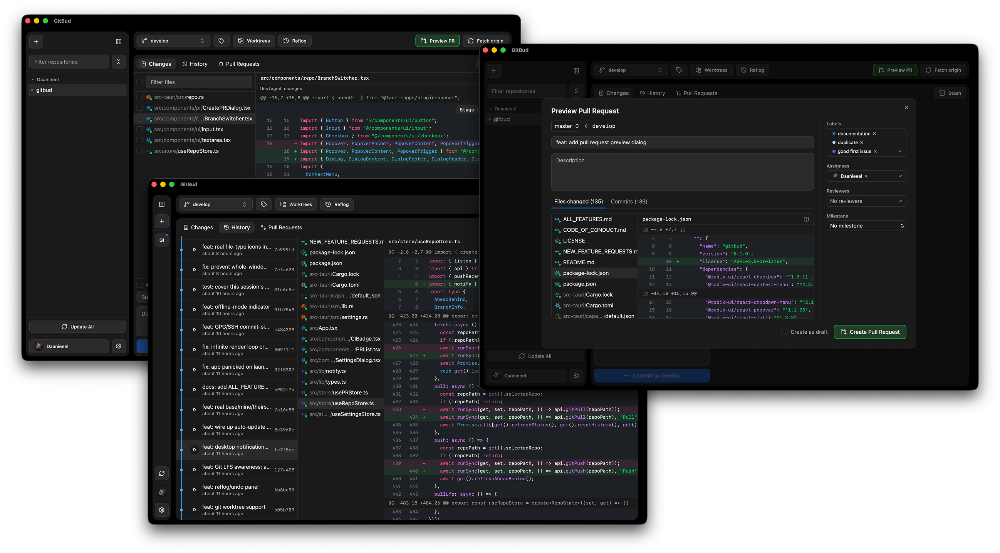

<div align="center">

# GitBud

**A Git client that doesn't eat your RAM.**

[](https://github.com/Daanieeel/gitbud/actions/workflows/ci.yml)
[](https://github.com/Daanieeel/gitbud/actions/workflows/release.yml)
[](LICENSE)
[](#getting-started)

</div>

Your Git client shouldn't idle at a gigabyte of RAM just to show you a diff. GitBud gives you the workflow you already know — sidebar, changes, history, PRs, stage-and-commit, one-click sync — without the bundled Chromium tax. It's built on Tauri, not Electron, so it opens instantly and gets out of your way.

<div align="center">

</div>

> **Status: early and moving fast.** GitBud is pre-1.0 and under active development — the core workflow (stage, commit, branch, sync, review PRs) is solid daily-driver territory, but expect rough edges elsewhere. This is a good time to open issues, suggest features, or send a PR that shapes where it goes next.

## Contents

- [Roadmap](#roadmap)
- [Features](#features)
- [Performance, not as an afterthought](#performance-not-as-an-afterthought)
- [Getting Started](#getting-started)
  - [Download](#download)
  - [Build from source](#build-from-source)
- [Architecture](#architecture)
- [Contributing](#contributing)
- [License](#license)

## Roadmap

- [ ] Auto-updater
- [X] Bring uncommitted changes to other branch feature
- [X] PR quick link on current branch
- [X] GitHub profile pictures in commit history
- [ ] Delete branch on remote feature
- [ ] Pop-out merge conflict resolution editor
- [ ] Settings redesign
- [ ] Open File in Editor
- [ ] ...and more to come

## Features

- **Find any repo fast** — sidebar grouped by owner/remote, filterable, with dirty-state and ahead/behind badges at a glance; right-click for terminal, Finder, or copy-path
- **Stage exactly what you mean** — whole files *or individual hunks*, discard down to a single hunk, real syntax-highlighted inline diffs, virtualized so huge repos don't lag
- **Resolve conflicts without leaving the app** — dedicated view: Use Mine / Use Theirs / edit manually / mark resolved
- **Commit with confidence** — summary + description that survives tab switches, one-click amend, warnings before you commit to a protected branch
- **See your history clearly** — virtualized log with a real `git log --graph`-style lane graph, cherry-pick, revert, create-branch-here, plus CI status and GPG/SSH verification badges right on each commit
- **Manage branches in one place** — create/rename/delete/merge from a single popover, with a one-click pruner for branches already merged
- **Review and ship PRs in-app** — browse open/closed/all, create with your `.github/PULL_REQUEST_TEMPLATE.md` auto-loaded, checkout locally in one click, leave inline review comments, merge/squash/rebase
- **Sign in the way you already work** — zero-config via a detected `gh` CLI login, or Device Flow if you'd rather skip the CLI; GitHub Enterprise Server supported too
- **Sync without surprises** — fetch/pull/push with live streamed output, your choice of pull strategy, fork/upstream tracking with one-click fast-forward
- **Tune it to your workflow** — theme, git identity (global or per-repo), diff whitespace/font-size, sidebar sort, custom git binary, filesystem-watch toggle

## Performance, not as an afterthought

These are the actual reasons this project exists:

- Idle RAM target: **under 50MB** with a repo open
- Cold start to interactive: **under 1 second**
- No polling, anywhere — repo state changes are pushed by filesystem events
- Every list (files, commits) is virtualized
- Diffs are computed in Rust and shipped as structured hunks, never raw file blobs

## Getting Started

### Download

Pre-built installers for macOS, Windows, and Linux are published on the [Releases page](https://github.com/Daanieeel/gitbud/releases) whenever a new version ships. They aren't code-signed yet, so your OS will warn you before the first launch — that's expected for a project this early, not a red flag.

**macOS:** you'll see `"GitBud.app" is damaged and can't be opened` — this is Gatekeeper blocking an unnotarized app, not actual corruption. Fix it by removing the quarantine flag:

```bash
xattr -cr /Applications/GitBud.app
```

### Build from source

**Prerequisites:** [Node.js](https://nodejs.org/) 18+, [Rust](https://rustup.rs/), and the [Tauri prerequisites](https://tauri.app/start/prerequisites/) for your OS.

```bash
git clone https://github.com/Daanieeel/gitbud.git
cd gitbud
npm install

# run in dev mode (hot-reloads the frontend, rebuilds Rust on change)
npm run tauri dev

# build a release binary
npm run tauri build
```

Run the Rust test suite from `src-tauri/`:

```bash
cd src-tauri
cargo test
```

### GitHub features

Pull requests, checks, and review comments need a signed-in GitHub account. GitBud has no bundled OAuth credentials (it's not affiliated with GitHub) — the easiest path is having the [GitHub CLI](https://cli.github.com/) installed and logged in (`gh auth login`); GitBud will detect it automatically. Otherwise, sign in via Device Flow using your own [OAuth App](https://github.com/settings/applications/new) (Settings → GitHub).

## Architecture

- **Rust (`src-tauri/`)** — all git truth lives here: `git2` for status/diff/staging/commit/branch/history/hunks, system `git`/`gh` shelled out for anything touching auth (fetch/pull/push/clone), `notify` for debounced filesystem watching, OS keychain for GitHub tokens.
- **React + TypeScript (`src/`)** — a thin rendering layer over Tauri commands/events. Zustand stores per concern (repo state, GitHub, PRs, settings). No git logic on the frontend, by design — it should be replaceable without touching a single Rust file.

## Contributing

Issues and PRs welcome — this is early enough that a well-argued PR can genuinely shape the roadmap. Please also read the [Code of Conduct](CODE_OF_CONDUCT.md). A few ground rules to keep this project on-mission:

1. **RAM and cold-start numbers are acceptance criteria, not vibes.** If a change adds meaningful idle memory or startup time, it needs a reason.
2. **No polling.** State changes should be event-driven (filesystem watcher, Tauri events), not timers.
3. **Auth stays out of Rust.** Anything that needs a user's GitHub credentials for git operations (fetch/pull/push/clone) shells out to system `git`; only the GitHub *API* (PRs, checks, comments) talks HTTP directly, using tokens from Device Flow or `gh`.
4. **Keep the frontend dumb.** Git logic belongs in `src-tauri/`, not in a Zustand store.

Every push and PR runs through [CI](.github/workflows/ci.yml) — `cargo check` + `cargo test` on macOS, Windows, and Linux, plus a frontend typecheck and build. Keep it green.

## License

[GNU Affero General Public License v3.0 or later](LICENSE) — free to use, modify, and redistribute (commercially or not), but any distributed or network-served version, including a modified or hosted one, must keep its source available under the same terms. It can never be relicensed as closed-source/proprietary.
